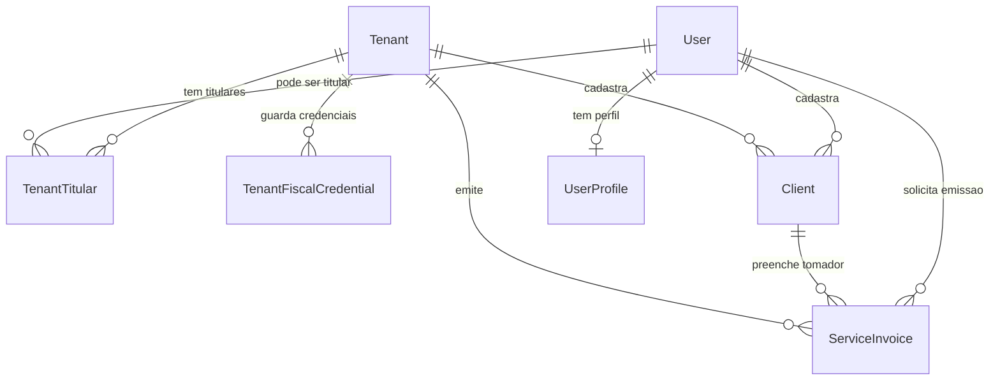
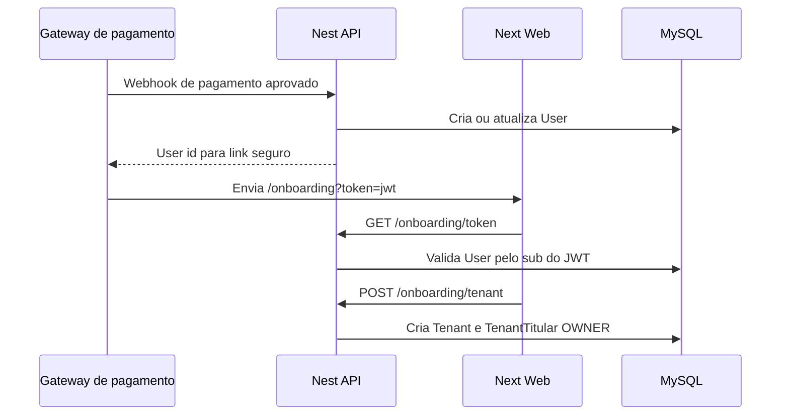

# Arquitetura do mini ERP

## Objetivo

O sistema passa a ser um mini ERP fiscal multiempresa. A entidade principal do banco e `Tenant`, que representa a empresa emissora. Usuarios continuam existindo como identidade de acesso, mas a titularidade empresarial fica em `TenantTitular`.

Regra de nascimento do tenant: uma empresa nao deve ser criada livremente por um usuario logado no dashboard. O tenant nasce no fluxo de contratacao/onboarding. O usuario titular ja deve existir no banco, criado ou garantido pelo webhook do gateway de pagamento. O link de onboarding recebe um JWT na URL, valida o `sub` como `User.id` e cria em uma unica transacao a empresa contratante e o vinculo `TenantTitular` com papel `OWNER`.

## Dominio



## Responsabilidades

- `Tenant`: cadastro fiscal da empresa, CNPJ, inscricao municipal, regime tributario, endereco, provider fiscal e dados base para NFS-e.
- `TenantFiscalCredential`: credenciais fiscais criptografadas por tenant e provider, como API key e identificador da empresa no fornecedor.
- `TenantTitular`: ligacao entre tenant e usuario, com papel societario/operacional, permissao de emissao e flag de representante legal.
- `Client`: cadastro mestre de tomadores por tenant, com CPF/CNPJ, contato, endereco, inscricoes e usuario que cadastrou.
- `ServiceInvoice`: nota fiscal de servico solicitada pelo sistema, com tomador, servico, valores, status, payload enviado e resposta do provider.
- `User`: identidade de login e permissao geral do sistema.

## Backend

O backend Nest concentra todo o dominio:

- `TenantsModule`: administracao de empresas existentes e titulares.
- `OnboardingModule`: valida token JWT de contratacao, cria tenant e vincula o usuario existente como titular inicial.
- `ClientsModule`: CRUD de clientes por tenant.
- `InvoicesModule`: emissao e historico de notas de servico.
- `FiscalProviderFactory`: escolhe o adapter fiscal configurado no tenant.
- `TenantFiscalCredentialsService`: persiste credenciais fiscais por tenant, sem expor o segredo nas respostas da API.
- `TenantSecretCryptoService`: criptografa e descriptografa segredos fiscais com AES-256-GCM.
- `PrismaModule`: acesso ao MySQL via Prisma.
- `AuthModule`: validacao de credenciais.

Os modulos ficam em `apps/api/src/modules`. Cada modulo segue uma estrutura pronta para CQRS:

```txt
modules/<module>
  <module>.module.ts
  presentation/
    <module>.controller.ts
  application/
    <module>.service.ts
    dto/
    commands/
    queries/
  domain/
  infrastructure/
```

Hoje os services concentram os casos de uso para manter o projeto enxuto. Quando a regra crescer, os casos de uso podem migrar para handlers em `application/commands` e `application/queries` sem mudar a borda HTTP.

O frontend nunca fala direto com o banco nem com API fiscal externa. Ele chama as rotas do Next, que validam sessao com `iron-session` e repassam para o Nest.

## Frontend

O Next funciona como camada de experiencia:

- `/api/*`: proxy autenticado com `iron-session`.
- TanStack Query: consumo com cache, mutations e invalidacao apos alteracoes.
- Dashboard: empresas, titulares, notas fiscais e usuarios.
- `/onboarding?token=...`: valida o token de contratacao e abre a primeira configuracao da empresa contratante.
- Ao emitir NFS-e, selecionar um cliente preenche automaticamente os dados do tomador e salva `clientId` na nota para auditoria.

Os componentes de dominio ficam em `apps/web/src/modules`, mas sem estrutura CQRS no frontend. CQRS no web ficou desnecessario neste momento porque o estado principal vem do backend e as telas chamam endpoints HTTP diretamente.

```txt
modules/<module>
  components/
```

As rotas do Next continuam em `src/app`, porque o App Router depende dessa convencao. Essas rotas devem permanecer finas, chamando utilitarios compartilhados e codigo de modulo quando a complexidade aumentar.

Server-state e cache ficam em TanStack Query:

- `apps/web/src/shared/api/query-client.tsx`: inicializa `QueryClient`.
- `apps/web/src/shared/api/http-client.ts`: client HTTP unico.
- `apps/web/src/shared/api/query-keys.ts`: chaves de cache padronizadas.
- `apps/web/src/modules/erp/validation`: schemas Yup para validar formularios antes do backend.

## Onboarding por pagamento

O token esperado pelo onboarding deve ser assinado com `ONBOARDING_JWT_SECRET` e conter:

```ts
{
  sub: user.id,
  purpose: "tenant_onboarding",
  exp: timestamp
}
```

Fluxo planejado:



Enquanto o webhook real nao existe, o script de desenvolvimento gera um link valido para um usuario existente:

```bash
pnpm onboarding:token -- --email admin@atlas.dev
```

## Banco

MySQL roda em container separado. As alteracoes de schema devem ser versionadas com Prisma Migrate:

```bash
pnpm db:migrate -- --name nome_da_mudanca
```

No Docker de aplicacao, use:

```bash
pnpm db:migrate:deploy
```

O Prisma usa schema multi-file em `apps/api/prisma`:

```txt
prisma/
  schema.prisma
  models/
    users.prisma
    tenants.prisma
    clients.prisma
    invoices.prisma
  migrations/
  seed.ts
```

`schema.prisma` fica como arquivo principal com `generator` e `datasource`. Os models e enums ficam separados por dominio em `models/*.prisma`. A configuracao fica em `apps/api/prisma.config.ts`, apontando `schema: "prisma"` e `migrations.path: "prisma/migrations"`.

## Seguranca operacional

- Chaves reais de providers fiscais nao ficam em variaveis de ambiente por tenant.
- O ambiente guarda apenas segredos globais de infraestrutura, como `ONBOARDING_JWT_SECRET`, `FISCAL_CREDENTIALS_ENCRYPTION_KEY` e `NFEIO_BASE_URL`.
- Payload e resposta do provider sao persistidos para auditoria.
- `TenantTitular` prepara a base para RBAC por empresa.
- Segredos fiscais ficam por tenant em `TenantFiscalCredential`, criptografados em repouso.
- `FISCAL_CREDENTIALS_ENCRYPTION_KEY` deve ser tratado como chave-mestre da aplicacao e futuramente migrado para KMS/cofre.
- `MOCK` e o provider padrao para desenvolvimento.
- Emissao real deve passar por homologacao por municipio e revisao contabil.
