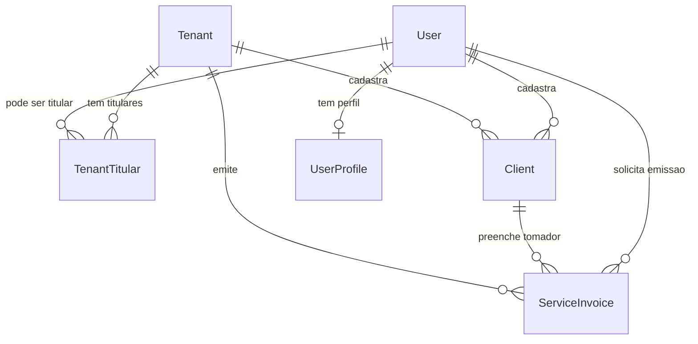

# Arquitetura do mini ERP

## Objetivo

O sistema passa a ser um mini ERP fiscal multiempresa. A entidade principal do banco e `Tenant`, que representa a empresa emissora. Usuarios continuam existindo como identidade de acesso, mas a titularidade empresarial fica em `TenantTitular`.

## Domínio



## Responsabilidades

- `Tenant`: cadastro fiscal da empresa, CNPJ, inscricao municipal, regime tributario, endereco, provider fiscal e dados base para NFS-e.
- `TenantTitular`: ligacao entre tenant e usuario, com papel societario/operacional, permissao de emissao e flag de representante legal.
- `Client`: cadastro mestre de tomadores por tenant, com CPF/CNPJ, contato, endereco, inscricoes e usuario que cadastrou.
- `ServiceInvoice`: nota fiscal de servico solicitada pelo sistema, com tomador, servico, valores, status, payload enviado e resposta do provider.
- `User`: identidade de login e permissao geral do sistema.

## Backend

O backend Nest concentra todo o dominio:

- `TenantsModule`: CRUD de empresas e titulares.
- `ClientsModule`: CRUD de clientes por tenant.
- `InvoicesModule`: emissao e historico de notas de servico.
- `FiscalProviderFactory`: escolhe o adapter fiscal configurado no tenant.
- `PrismaModule`: acesso ao MySQL via Prisma.
- `AuthModule`: validacao de credenciais.

O frontend nunca fala direto com o banco nem com API fiscal externa. Ele chama as rotas do Next, que validam sessao com `iron-session` e repassam para o Nest.

## Frontend

O Next funciona como camada de experiencia:

- `/api/*`: proxy autenticado com `iron-session`.
- SWR: consumo com cache e `mutate` apos alteracoes.
- Dashboard: empresas, titulares, notas fiscais e usuarios.
- Ao emitir NFS-e, selecionar um cliente preenche automaticamente os dados do tomador e salva `clientId` na nota para auditoria.

## Banco

MySQL roda em container separado. As alteracoes de schema devem ser versionadas com Prisma Migrate:

```bash
pnpm db:migrate -- --name nome_da_mudanca
```

No Docker de aplicacao, use:

```bash
pnpm db:migrate:deploy
```

## Segurança operacional

- Credenciais fiscais ficam em variaveis de ambiente.
- Payload e resposta do provider sao persistidos para auditoria.
- `TenantTitular` prepara a base para RBAC por empresa.
- `MOCK` e o provider padrao para desenvolvimento.
- Emissao real deve passar por homologacao por municipio e revisao contabil.
